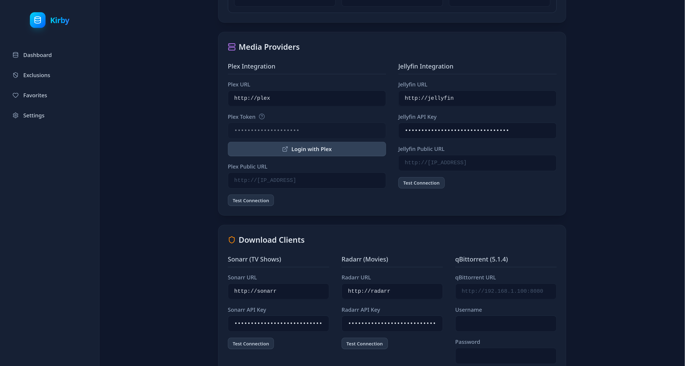

# 🌟 Kirby: Automated Media Purger

<p align="center">
  
</p>

Kirby is a centralized deletion and exclusion manager for home media setups. It interfaces with **Plex**, **Jellyfin**, **Radarr**, **Sonarr**, and **qBittorrent** to keep your storage under control automatically.

---

## ✨ Features

- **Automated Deletion Queue** — Ranks unwatched media by last-seen date and size, and purges it once your storage threshold is reached.
- **Smart Shield (Auto-Exclusions)** — Tracks deletion history per item. Once a title is deleted more than a configurable number of times it is permanently excluded, preventing re-download cycles.
- **Favorite Detection** — Protects media favorited by Plex and Jellyfin users. Supports per-user targeting, cross-server aggregation, and per-item "Ignore" overrides.
- **Multi-Server Ready** — Maps paths across Plex, Jellyfin, Sonarr, and Radarr with auto-complete suggestions from each service.
- **Authentication** — Built-in username/password login with JWT sessions. Supports SSO via any OIDC-compatible provider (Authentik, Keycloak, Auth0, Authelia, …).
- **Dynamic Frontend** — Search, filter, sort, and paginate across all tabs. Contextual help tooltips on every settings field.

---

## ⚙️ How it works

1. Kirby fetches your watch history from Plex and/or Jellyfin.
2. It cross-references items against Radarr (movies) and Sonarr (shows) to get file paths and sizes.
3. Items are ranked by a combination of last-seen date and storage impact.
4. When free space on a configured storage falls below your target, the deletion job removes the lowest-ranked eligible items via Radarr/Sonarr (and optionally qBittorrent).
5. Excluded items and favorites are never touched.

---

## 🐳 Docker Deployment

```yaml
services:
  kirby:
    image: jolanl/kirby:latest
    container_name: kirby
    restart: unless-stopped
    ports:
      - "4000:4000"
    volumes:
      - ./config:/app/backend/data
    environment:
      - TZ=Europe/Paris
```

```bash
docker-compose up -d
```

Kirby is available at `http://localhost:4000`. On first visit you will be prompted to create an admin account.

---

## 🔐 Authentication

### Username / Password

On first run, create your admin credentials at `http://localhost:4000`. You can change them later in **Settings → Security**.

### SSO / OAuth2 (OIDC)

Kirby supports any OIDC-compatible identity provider. Configure it in **Settings → SSO / OAuth2**.

| Field                     | Description                                                                                |
| ------------------------- | ------------------------------------------------------------------------------------------ |
| **Issuer URL**            | Base URL of your provider — Kirby fetches `<issuer>/.well-known/openid-configuration`      |
| **Client ID**             | The application/client ID registered in your provider                                      |
| **Client Secret**         | Client secret (required for confidential clients)                                          |
| **Scopes**                | Space-separated scopes — default: `openid profile email`                                   |
| **Redirect URI override** | Leave empty — auto-derived from request headers (`X-Forwarded-Proto` / `X-Forwarded-Host`) |

**Issuer URL by provider:**

| Provider  | Issuer URL                                          |
| --------- | --------------------------------------------------- |
| Authentik | `https://auth.example.com/application/o/<app-slug>` |
| Keycloak  | `https://keycloak.example.com/realms/<realm>`       |
| Auth0     | `https://<tenant>.auth0.com`                        |
| Authelia  | `https://auth.example.com`                          |

Register `https://<your-kirby-host>/api/auth/oauth/callback` as the redirect URI in your provider.

The **Test Connection** button in Settings validates your current form values against the provider's discovery document — no need to save first.

---

## 📸 Screenshots

### 📊 Dashboard

The deletion queue ranked by priority. Sort by rank, title, last seen, or size. Use **Sync Now** to trigger an immediate queue refresh.

<p align="center">
  
</p>

### 🖼️ Exclusions

Permanently shielded items. Filter by auto-excluded (hit the deletion threshold) or manually added.

<p align="center">
  
</p>

### ❤️ Favorites

All media favorited across your Plex and Jellyfin servers. Hover any item to toggle its protection — **Ignore** re-enters it in the deletion queue, **Restore** re-enables the shield.

<p align="center">
  
</p>

### ⚙️ Settings

Connect services, configure storage targets, automation rules, and SSO. Every field has a contextual help tooltip.

<p align="center">
  
</p>
<p align="center">
  
</p>

---

## 🚀 Local Development

**Prerequisites:** Node.js v18+

```bash
# Install dependencies
npm install --prefix backend
npm install --prefix frontend

# Start backend (port 4000)
npm run dev --prefix backend

# Start frontend (port 5173, proxies /api → localhost:4000)
npm run dev --prefix frontend
```

---

## 🛠 Tech Stack

- **Backend:** Node.js, Express, better-sqlite3, jsonwebtoken, bcryptjs
- **Frontend:** React 19, Vite, Tailwind CSS v4, Lucide
- **Auth:** JWT (httpOnly cookies) + OIDC Authorization Code Flow with PKCE
- **Integrations:** Plex, Jellyfin, Radarr, Sonarr, qBittorrent

---

<p align="center">
  Made with ❤️ for Homelab Enthusiasts.
</p>
