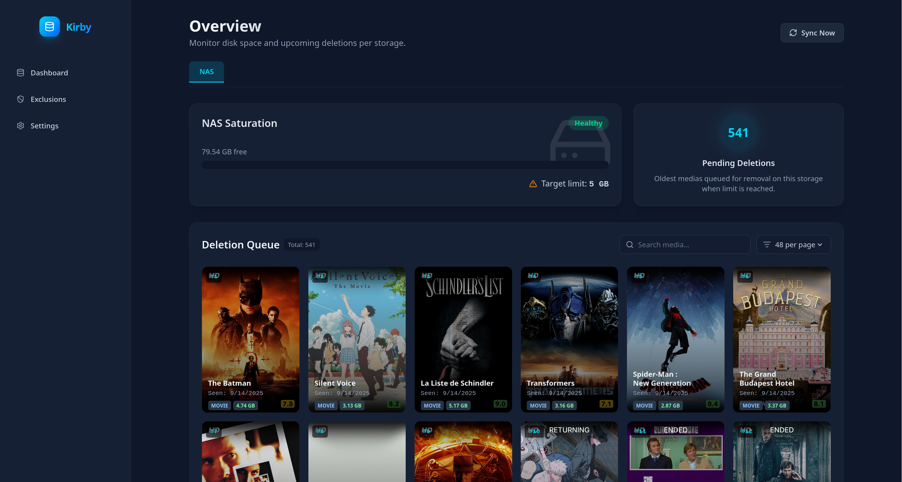
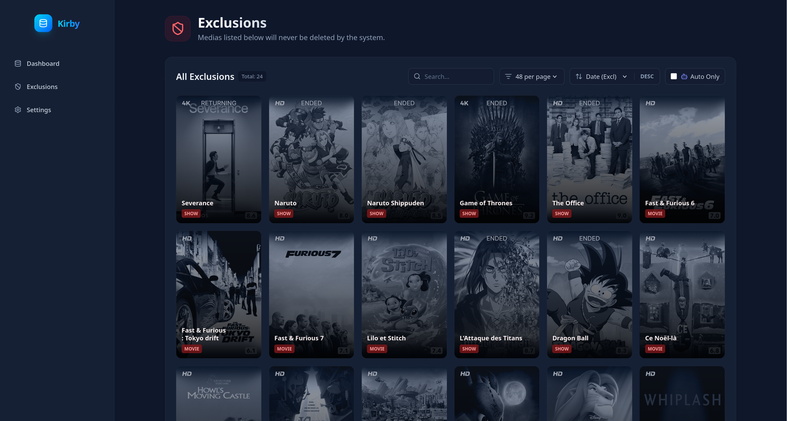
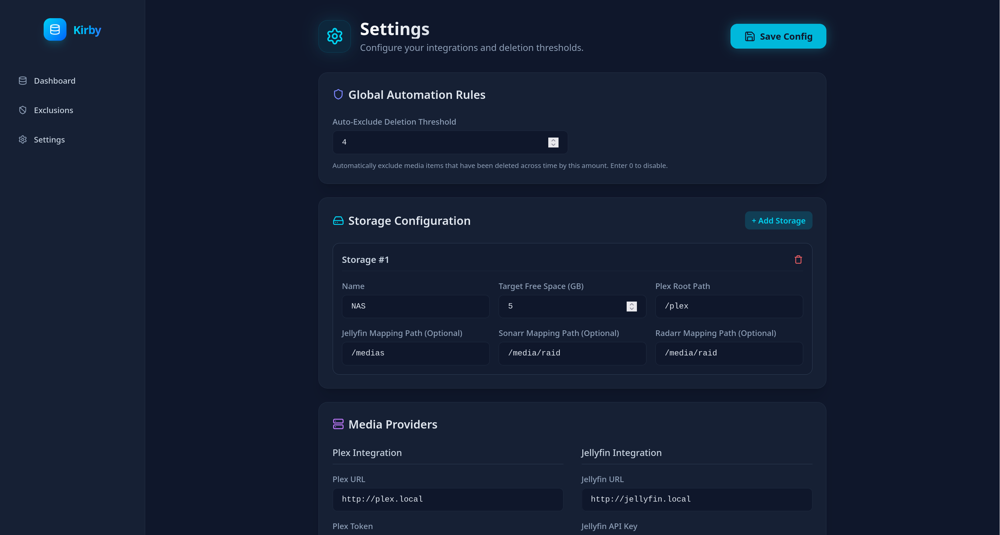

# 🌟 Kirby: Automated Media Purger & Shield

<p align="center">
  
</p>

Kirby is a powerful, centralized deletion and exclusion manager designed for sophisticated home media setups. It natively interfaces with **Plex**, **Jellyfin**, **Radarr**, **Sonarr**, and **qBittorrent** to help you keep your storage limits in check without lifting a finger.

---

## ✨ Features

- **Automated Deletion Queue:** Keeps track of your unwatched or older media and intelligently purges it once designated storage thresholds are met.
- **Smart Shield (Auto-Exclusions):** Tracks the deletion history of your library natively. If a movie or series hits your custom threshold of deletions over time, Kirby safely locks it away into the **Exclusions** list to prevent future re-deletions automatically!
- **Multi-Server Ready:** Easily toggle paths and storage mapping across Plex and Jellyfin arrays.
- **Dynamic Frontend:** Built with React & Vite + Tailwind, giving you native searching, filtering, and rapid-pagination.

---

## 🐳 Docker Deployment

The easiest way to run Kirby is via Docker Compose.

### Docker Compose

```yaml
services:
  kirby:
    image: jolanl/kirby:latest
    container_name: kirby
    restart: unless-stopped
    ports:
      - "4000:4000"
    volumes:
      - ./config:/app/backend/data
    environment:
      - TZ=Europe/Paris
```

1. **Deploy the Container**

   ```bash
   docker-compose up -d
   ```

2. **Access the Interface**
   Kirby will be available at `http://localhost:4000`.

---

## 📸 Screenshots

### 🖼️ Exclusions Architecture

Visualize and manage your shielded media gracefully. Filter directly by items caught by the "Auto" shield rules.

<p align="center">
  
</p>

### ⚙️ Deep Configuration Setup

Connect everything seamlessly using the global settings. Set your free-space targets, custom endpoints, and automation rules in seconds.

<p align="center">
  
</p>

---

## 🚀 Quickstart & Usage

**Prerequisites:** Node.js v18+. SQLite (handled automatically).

1. **Install Dependencies**
   Run the setup to install both backend and frontend environments automatically.

   ```bash
   ./start.sh
   # Or manually:
   # npm install --prefix backend
   # npm install --prefix frontend
   ```

2. **Access the Web Interface**
   Once started, Kirby listens gracefully at `http://localhost:5173`.

3. **Configure Your API Access**
   Navigate to the **Settings** menu via the navigation bar and pipe in your server credentials (e.g., Plex Tokens, Radarr API Keys).

4. **Verify Your Paths!**
   Click _Test Connection_ to validate the link constraints. Use the `Storage Configuration` segment to map internal Docker paths seamlessly.

---

## 🛠 Tech Stack

- **Backend:** Node.js, Express, better-sqlite3
- **Frontend:** React, Vite, Tailwind CSS, Lucide
- **Integrations Supported:** Radarr, Sonarr, qBittorrent, Plex, Jellyfin

---

<p align="center">
  Made with ❤️ for Homelab Enthusiasts. 
</p>
